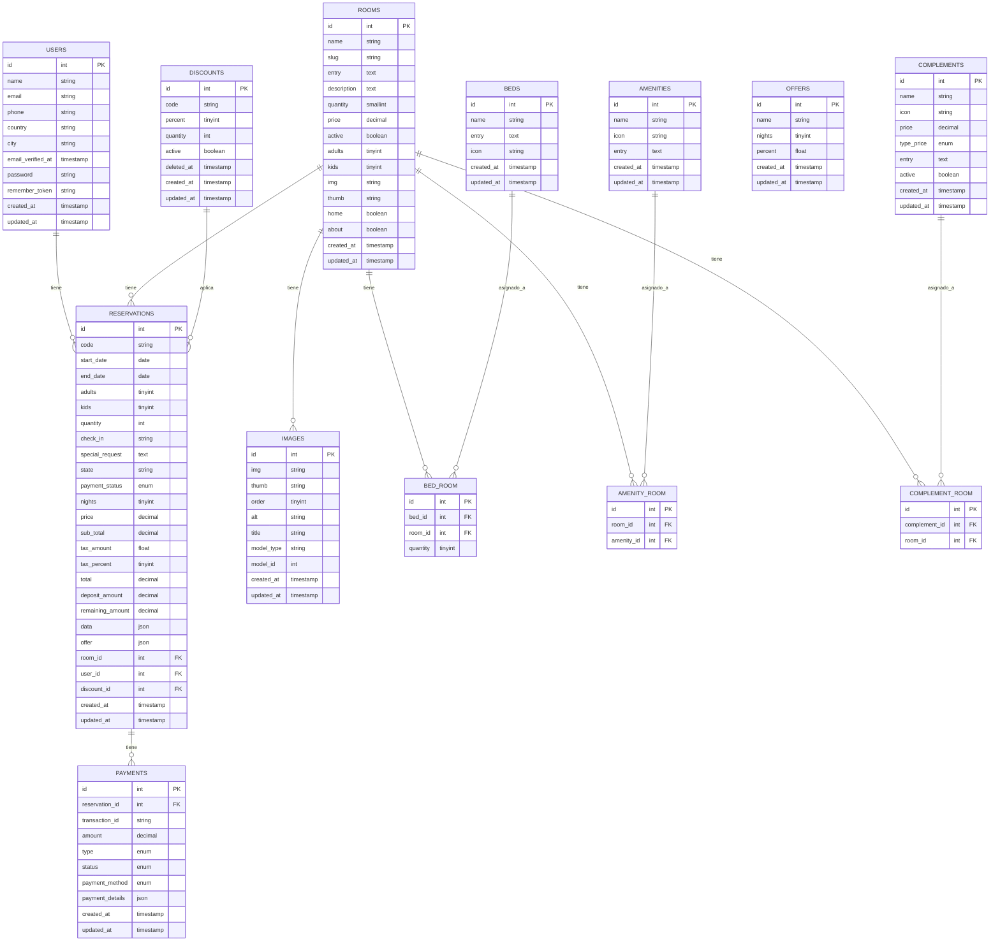

# Diagrama de Base de Datos Hotel

## Descripción de Tablas Principales

### Users (Usuarios)

Almacena información de los usuarios registrados en el sistema, incluyendo datos de contacto como nombre, correo electrónico, teléfono, país y ciudad.

### Rooms (Habitaciones)

Contiene información sobre las habitaciones disponibles en el hotel, incluyendo nombre, descripción, precio, capacidad y características.

### Reservations (Reservaciones)

Registra las reservaciones realizadas por los usuarios, incluyendo fechas de entrada y salida, número de huéspedes, estado del pago y montos.

### Payments (Pagos)

Almacena información sobre los pagos realizados para cada reservación, incluyendo método de pago, monto y estado de la transacción.

### Complements (Complementos)

Servicios adicionales que pueden añadirse a las habitaciones, como desayuno, transporte, etc.

### Beds (Camas)

Tipos de camas disponibles que pueden asignarse a las habitaciones.

### Amenities (Comodidades)

Comodidades o servicios disponibles en las habitaciones, como Wi-Fi, aire acondicionado, etc.

### Offers (Ofertas)

Ofertas especiales basadas en número de noches.

### Discounts (Descuentos)

Códigos de descuento que pueden aplicarse a las reservaciones.

## Relaciones Principales

-   Cada usuario puede tener múltiples reservaciones
-   Cada habitación puede tener múltiples reservaciones
-   Cada reservación puede tener múltiples pagos
-   Las habitaciones pueden tener múltiples camas, amenidades y complementos
-   Las imágenes pueden estar asociadas a diferentes modelos como habitaciones
